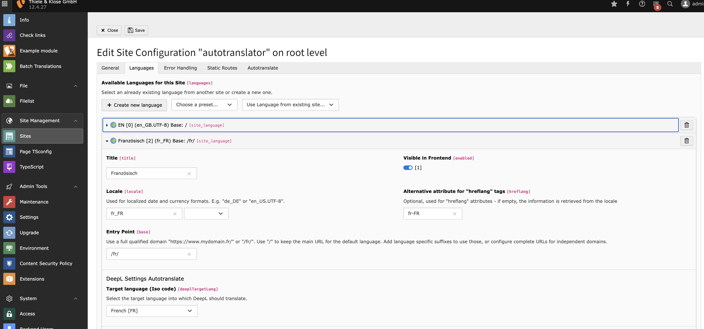

# Site Configurations

The basic configuration must be done via the TYPO3 page configuration.

### DeepL API-Key

The DeepL API key can be configured in the site configuration module under the DeepL tab.

### Translatable Languages

You should set the DeepL source language to your base language, otherwise DeepL will try to detect it based on the text to be translated. (since v1.1.1)

You have to set the DeepL target language for each language to be translated.

### Translatable types

You can choose for which of the supported content types (pages, tt_content or additional tables configured in [extension settings](../ExtensionConfiguration/Readme.md)) the automatic translation should be active.

### Example configuration for page

In the example, translations for pages are active. The title of the pages and files of the Media type is translated into German and French.

